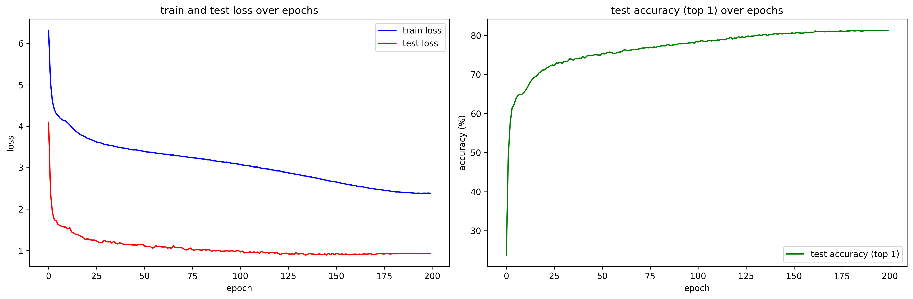

## pretraining
```
python -m pretraining --save_dir pretrained_weights \
                      --model_name facebook/vit-mae-base \
                      --n_epoch 400 \
                      --batch_size 256 \
                      --n_worker 8 \
                      --n_device 8 \
                      --precision 16-mixed \
                      --strategy ddp \
                      --save_frequency 20 \
                      --input_size 224 \
                      --wd 0.05 \
                      --norm_pix_loss
```

## finetuning
```
python -m finetuning --save_dir weights \
                     --model_name facebook/vit-mae-base \
                     --pretrained_dir pretrained_weights \
                     --n_epoch 200 \
                     --batch_size 128 \
                     --n_worker 8 \
                     --n_device 8 \
                     --precision 16-mixed \
                     --strategy ddp \
                     --save_frequency 5 \
                     --input_size 224 \
                     --drop_path_rate 0.1 \
                     --label_smoothing 0.1 \
                     --wd 0.05 
```

## result
- it takes about 48 hours for pretraining using `8 x RTX 3090`
- it takes about 36 hours for finetuning using `8 x RTX 3090`

|metric|mae_vit_base|vit_base|
|---|---|---|
|top1_acc|81.24|78.47|

