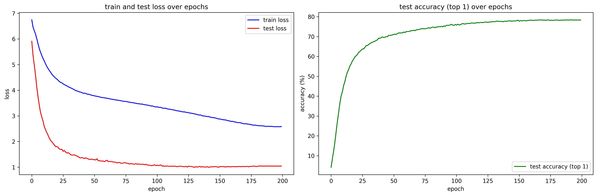

## train
```
python -m train --save_dir weights \
                --model_name vit_base_patch16_224  \
                --n_epoch 200 \
                --batch_size 128 \
                --n_worker 4 \
                --n_device 8 \
                --precision 16-mixed \
                --strategy ddp \
                --save_frequency 5 \
                --drop_path_rate 0.1 \
                --label_smoothing 0.1 \
                --input_size 224 \
                --gradient_clip_val 1.0
```

## result
- it takes about 36 hours using `8 x RTX 3090`

|metric|this repository|original paper|
|---|---|---|
|top1_acc|78.47|77.91|

